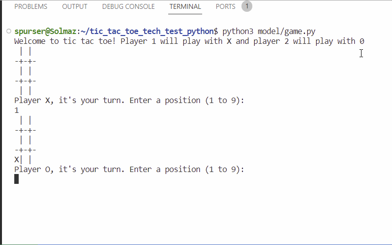
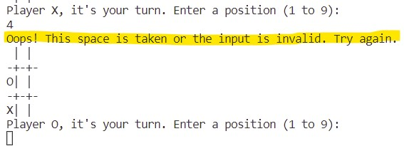

# Tic Tac Toe Tech Test in Python
This is a very common tech test as it demonstrates a candidate's knowledge of basic data structures.

Also known as noughts and crosses

# Description
The rules of tic tac toe are as follows:

There are two players in the game (X and O)
Players take turns until the game is over
A player can claim a field if it is not already taken
A turn ends when a player claims a field
A player wins if they claim all the fields in a row, column or diagonal
A game is over if a player wins
A game is over when all fields are taken
Build the business logic for a game of tic tac toe. It should be easy to implement a working game of tic tac toe by combining your code with any user interface, whether web or command line.

The game is played on a grid of 3 by 3 squares, creating 9 squares in total. Therefore, each game will consist of a maximum of 9 moves.

|Input|Process|Output|
|-----|-------|------|
|Player 1 chooses O and places it in a square|The program updates to include the O placed by player 1|The program shows the grid|
|Player 2 places X in an empty square|The program updates to include this move|The program shows the grid with the O and the X|
|Players 1 and 2 continue placing their markers|The program continues to update|The program stores and shows the outcome of each move|
|A marker creates an unbroken row, column or diagonal|The program stops the game and the player with the winning marker wins|The program stops and says the at player_ has won|
|Or, all of the squares are filled with markers, and none of the markers create an unbroken line of three|The program stops the game|The program responds that it is a draw|

# Requirements
Player 1 and 2
A grid of 3 by 3 squares
Data kept in memory and updated with each move

# What the program does
1. The program must take inputs from two players.
2. Each player has a single marker, an X or a O.
3. The program creates a grid comprised of 3 by 3 squares.
4. The program asks each player to place their marker in an empty square, with one marker per input.
5. The game ends when a marker creates an unbroken line of 3, or all of the sqaures are filled. Program responds with Player_ has won or it is a draw.
Extra: if there is time, create a class that keeps each players score from each game, and allows them to choose their own name, i.e they play 3 games, John: 2, Amy: 1.

# Edge cases
## Wrong data types
* The players do not input the correct marker.
## Unexpected inputs
* The players places the marker in a square that already contains a marker.
* Player doesn't make a move.

## Error handling
* Ask player to input correct marker.
* Ask player to place their marker in an empty square.
* Program doesn't remember a previous move.